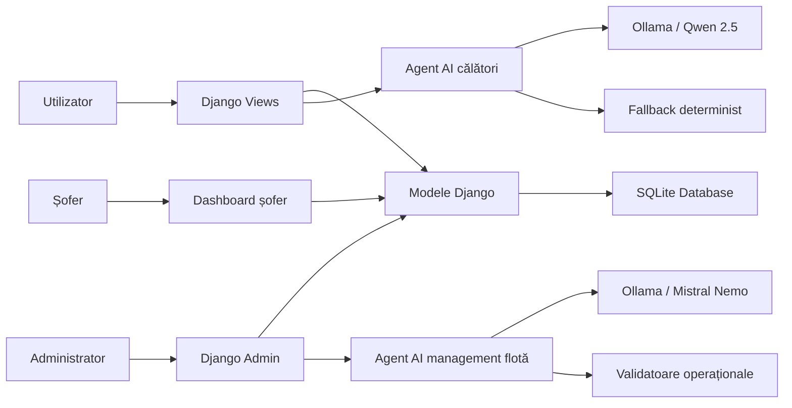
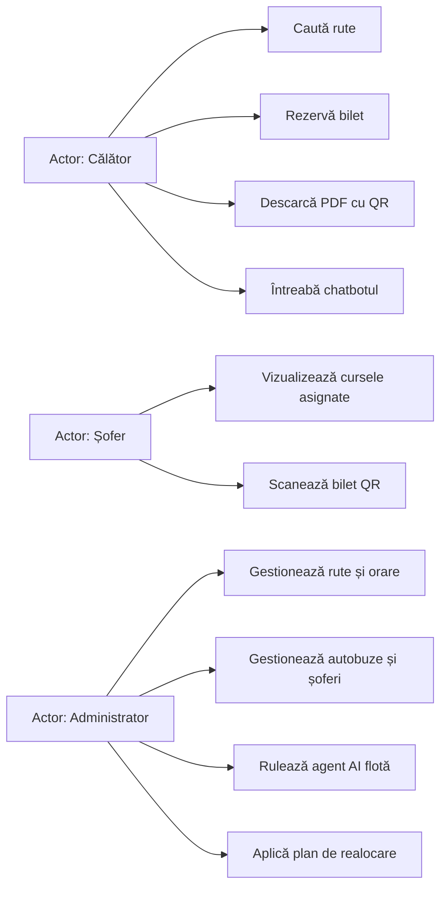
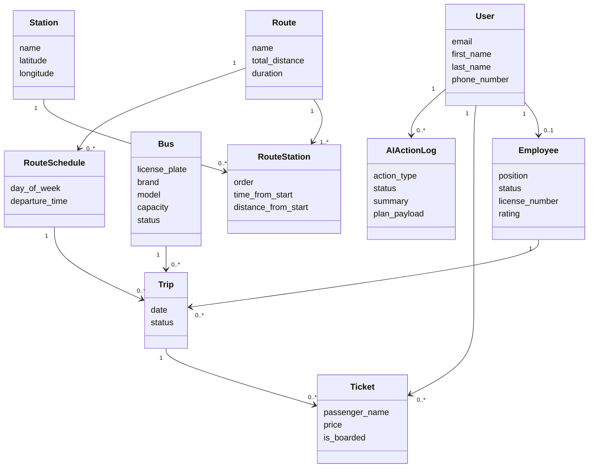
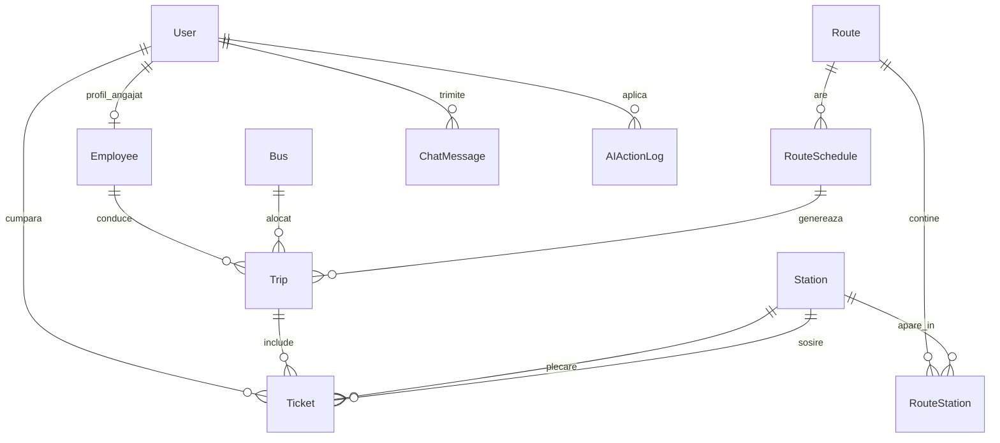
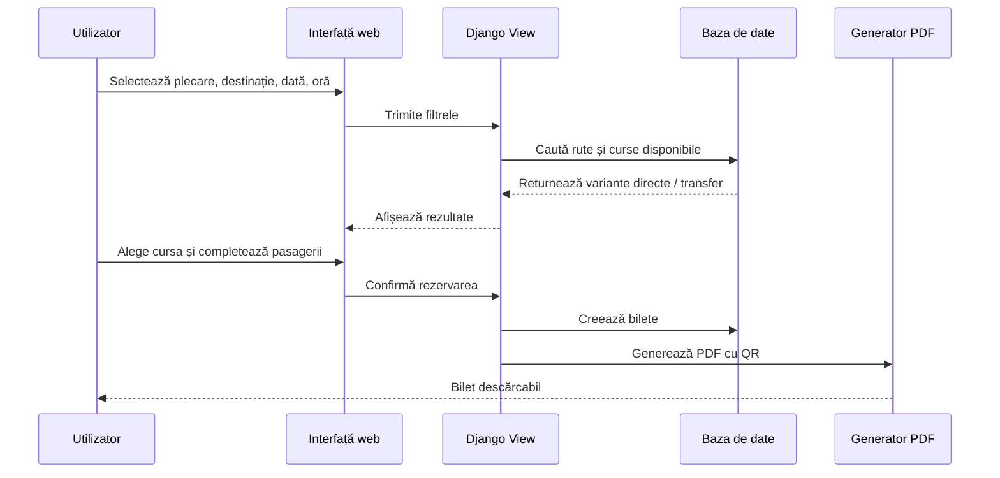
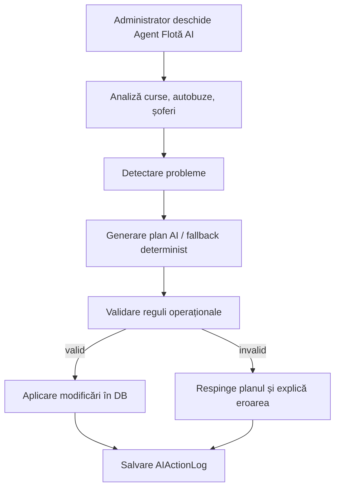
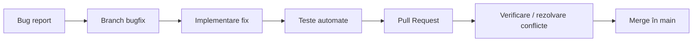
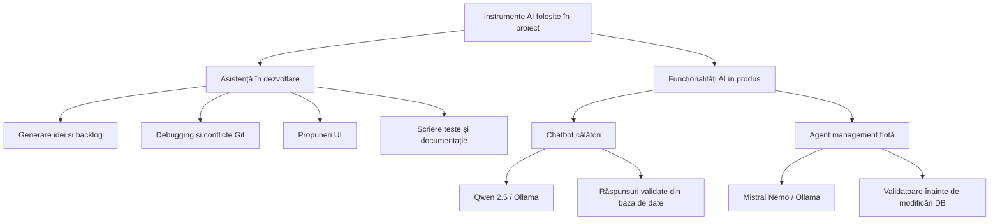

# Proces de Dezvoltare - AutoTrans Bus Fleet Manager

Acest document descrie procesul de dezvoltare al aplicației AutoTrans, cu accent pe cerințele proiectului la disciplina **Metode de Dezvoltare Software**: specificații, backlog, arhitectură, Git workflow, teste, bug reporting, design patterns și folosirea instrumentelor AI.

## 0. Maparea cerințelor din laborator

### Weeks 5&6

- Sprint Backlog: documentat prin Sprint Goal, backlog items selectate, plan de implementare și Definition of Done.
- UML: documentat prin diagrame de arhitectură, use case, class diagram, sequence diagram și diagramă pentru modelul de date.
- Git & Tests: documentat prin branch-uri, pull request-uri, commituri pe fiecare student, teste automate și GitHub Actions.

### Weeks 7&8

- Bug reports: documentat prin bug report concret, pași de reproducere, comportament actual/așteptat și rezolvare.
- Pull requests: documentat prin workflow-ul folosit pentru branch-uri și integrare în `main`.
- Design patterns: documentat prin pattern-uri folosite efectiv în proiect.
- AI reports: documentat prin raport despre folosirea AI în produs și în procesul de dezvoltare, inclusiv diagrame.

## 1. Scopul proiectului

AutoTrans este o aplicație web pentru gestionarea unei flote de autobuze și pentru rezervarea online a biletelor. Proiectul acoperă atât partea de utilizator, cât și partea operațională/administrativă.

Obiective principale:

- căutarea rutelor între stații
- afișarea curselor directe și cu transfer
- rezervarea biletelor online
- generarea biletelor PDF cu cod QR
- scanarea biletelor de către șoferi
- administrarea rutelor, orarelor, autobuzelor și șoferilor
- integrarea a doi agenți AI

## 2. Specificații și backlog

Procesul de dezvoltare a fost organizat pornind de la un backlog de produs, împărțit în funcționalități mari și user stories. Pentru sprinturile de lucru, backlog-ul a fost rafinat în elemente concrete, verificabile.

### Epic 1 - Căutare și rezervare bilete

User stories:

- Ca utilizator, vreau să caut curse între două stații, ca să aleg o variantă potrivită.
- Ca utilizator, vreau să pot căuta curse după dată și oră, ca să planific plecarea.
- Ca utilizator, vreau să văd rute cu transfer, ca să pot ajunge și între orașe fără cursă directă.
- Ca utilizator, vreau să rezerv bilete pentru mai mulți pasageri.
- Ca utilizator, vreau să primesc bilet PDF cu cod QR.

### Epic 2 - Dashboard șofer și validare bilete

User stories:

- Ca șofer, vreau să văd cursele mele.
- Ca șofer, vreau să scanez codul QR al biletului.
- Ca sistem, vreau să previn validarea de mai multe ori a aceluiași bilet.

### Epic 3 - Administrare flotă

User stories:

- Ca administrator, vreau să gestionez rute, stații și orare.
- Ca administrator, vreau să aloc autobuze și șoferi pe curse.
- Ca administrator, vreau să văd rapid problemele operaționale din flotă.

### Epic 4 - Agenți AI

User stories:

- Ca utilizator, vreau să pot întreba chatbotul cum ajung dintr-un oraș în altul.
- Ca utilizator, vreau să pot întreba despre preț, bilete, QR, rezervări și îmbarcare.
- Ca administrator, vreau ca agentul AI să detecteze conflicte de flotă.
- Ca administrator, vreau ca agentul AI să propună realocări de autobuze și șoferi.
- Ca administrator, vreau ca modificările aplicate de AI să fie validate înainte de salvare.

### Sprint Backlog - Increment aplicație funcțională

Sprint Goal:

```text
Realizarea unui flux complet de căutare și rezervare bilet, completat de doi agenți AI:
un asistent pentru călători și un agent pentru managementul flotei.
```

Product Backlog items selectate pentru sprint:

- implementarea modelelor pentru rute, stații, orare, curse și bilete
- interfață pentru căutarea rutelor
- suport pentru rute cu transfer
- checkout și generare bilet PDF cu QR
- dashboard pentru șofer și validare QR
- chatbot pentru întrebările călătorilor
- agent AI pentru analiza flotei
- teste automate pentru fluxurile critice
- curățarea și documentarea proiectului

Plan de implementare:

1. Definirea modelelor și migrațiilor
2. Implementarea view-urilor principale
3. Construirea interfeței pentru utilizatori
4. Implementarea fluxului de rezervare
5. Adăugarea dashboard-ului pentru șofer
6. Integrarea agentului AI pentru călători
7. Integrarea agentului AI pentru flotă
8. Scrierea testelor automate
9. Rezolvarea bug-urilor prin branch-uri și pull request-uri
10. Pregătirea documentației și a demo-ului live

Increment livrat:

- aplicație Django funcțională
- flux utilizator complet: căutare rută -> rezervare -> bilet PDF -> QR
- flux șofer: vizualizare curse -> scanare bilet
- flux admin: gestionare date -> analiză AI flotă
- teste automate și GitHub Actions

Definition of Done pentru increment:

- funcționalitatea este implementată
- codul este integrat în branch prin Git
- testele automate relevante trec
- nu există erori Django la `manage.py check`
- funcționalitatea poate fi demonstrată live
- datele demo permit testarea scenariului

## 3. Arhitectura aplicației

Aplicația este construită în Django și folosește arhitectura clasică Model-View-Template.



Componente principale:

- `core/models.py` - modelele de date
- `core/views.py` - view-uri pentru paginile publice și API-uri
- `core/chatbot.py` - agentul AI pentru călători
- `core/fleet_optimizer.py` - agentul AI pentru managementul flotei
- `core/admin.py` - panoul administrativ personalizat
- `core/tests.py` și `core/test_fleet_optimizer.py` - teste automate

### UML - Use Case Diagram



### UML - Class Diagram



## 4. Modelul bazei de date

Modelele principale:

- `User` - utilizator custom, autentificare prin email
- `Employee` - angajați, inclusiv șoferi
- `Bus` - autobuze
- `Station` - stații
- `Route` - rute
- `RouteStation` - ordinea stațiilor într-o rută
- `RouteSchedule` - orare săptămânale
- `Trip` - cursă concretă într-o anumită zi
- `Ticket` - bilet rezervat
- `ContactMessage` - mesaje din formularul de contact
- `ChatMessage` - istoric chatbot
- `AIActionLog` - jurnal pentru acțiunile agentului AI de management



## 5. Workflow-uri importante

### Căutare rută și rezervare



### Agent AI management flotă



## 6. Agenții AI implementați

### Agent 1 - Asistent AI pentru călători

Rol:

- clasifică intenția utilizatorului
- extrage stații, dată și oră
- răspunde la întrebări despre rute, preț, rezervări, bilete, QR și îmbarcare

Important: agentul nu inventează curse. AI-ul extrage intenția, iar rezultatele sunt calculate din baza de date prin logică deterministă.

Modele folosite/testate:

- Qwen 2.5 prin Ollama
- Llama
- Mistral Nemo
- Gemini API în experimente inițiale

### Agent 2 - Agent AI pentru managementul flotei

Rol:

- detectează conflicte de autobuz
- detectează conflicte de șofer
- verifică șoferi indisponibili sau peste 8 ore
- propune realocări de autobuze
- propune realocări de șoferi
- propune combinarea curselor slab ocupate
- validează planurile înainte de aplicare

Model recomandat:

- Mistral Nemo prin Ollama

Măsuri de siguranță:

- planurile AI sunt validate înainte de modificarea bazei de date
- acțiunile aplicate sunt salvate în `AIActionLog`
- există fallback determinist dacă modelul local nu răspunde

## 7. Source control și Git workflow

S-a folosit Git cu branch-uri dedicate pentru funcționalități:

- `feature/local-ai-travel-assistant`
- `feature/ai-fleet-optimizer`
- `feature/ui-redesign`
- `feature/route-refactor-and-admin-ui`
- `feature/flexible-route-search`
- `feature/chatbot-enhancements`
- `feature/wider-admin-panel`
- `bugfix/show-correct-waypoints-map-at-route-finder`

Au fost folosite:

- branch-uri separate pentru feature-uri
- pull request-uri
- merge-uri în `main`
- rezolvare conflicte
- commituri incrementale

Workflow folosit pentru pull request-uri:

1. Se creează un branch dedicat pentru feature sau bugfix.
2. Se implementează modificările local.
3. Se rulează testele relevante.
4. Se face push pe GitHub.
5. Se deschide pull request către `main`.
6. Se rezolvă eventualele conflicte.
7. Se face merge în `main` după verificare.

Exemple de pull request-uri / branch-uri:

- `feature/ai-fleet-optimizer` -> integrarea agentului AI pentru flotă
- `feature/local-ai-travel-assistant` -> integrarea chatbotului local
- `feature/flexible-route-search` -> căutare rută doar cu plecare
- `feature/chatbot-enhancements` -> îmbunătățiri chatbot
- `feature/wider-admin-panel` -> îmbunătățiri UI admin

Commituri per student, conform istoricului Git:

- Stemate Cătălin: peste 5 commituri
- Dumitru Andrei: peste 5 commituri
- Panturu Daniel: peste 5 commituri

## 8. Teste automate și verificări

Proiectul include teste automate Django.

Comandă:

```bash
python manage.py test core
```

Verificări efectuate:

- modele principale
- validări pentru angajați/șoferi
- căutare rute
- căutare cu plecare fără destinație
- chatbot pentru rute directe
- chatbot pentru transferuri
- chatbot pentru prețuri
- agent AI de management
- realocare autobuze
- realocare șoferi
- combinare curse
- acces admin pentru agentul de flotă

Rezultat local:

```text
31 teste OK
```

Există și workflow GitHub Actions:

- instalare dependențe
- lint cu Ruff
- migrații
- rulare teste
- testare pe Linux, Windows și macOS

## 9. Bug report și rezolvare prin PR

Bug tratat:

**Căutarea rutelor nu afișa rezultate utile când utilizatorul selecta doar stația de plecare.**

Format bug report:

```text
Titlu: Fix route search when only departure station is selected

Context:
Pagina de căutare rute permite alegerea stației de plecare și a destinației.
Utilizatorul poate dori să exploreze toate rutele care pleacă dintr-o locație.

Pași de reproducere:
1. Deschide pagina /rute/.
2. Selectează doar stația de plecare.
3. Lasă destinația necompletată.
4. Apasă pe „Caută rute”.

Comportament actual:
Nu sunt afișate rutele disponibile care pleacă din stația selectată.

Comportament așteptat:
Sistemul afișează cursele/rutele care pleacă din stația selectată.

Impact:
Utilizatorul nu poate explora ușor destinațiile disponibile dintr-o locație.
```

Comportament inițial în aplicație:

- utilizatorul selecta doar plecarea
- apăsa „Caută rute”
- aplicația nu afișa rutele care pleacă din acea locație

Comportament așteptat:

- aplicația afișează rutele posibile care pleacă din stația selectată

Branch folosit:

```text
14-fix-route-search-when-only-departure-station-is-selected
feature/flexible-route-search
```

Rezolvare:

- actualizarea logicii de căutare
- adăugarea unui test automat pentru căutare doar cu plecare
- integrarea prin pull request

Pull request flow pentru bug:



Alt bug rezolvat:

**Chatbotul interpreta diferit întrebarea „mâine la ora 15 am autobuz București-Alexandria?” pe calculatoare diferite.**

Cauză:

- fallback-ul recunoștea `15:00`, dar nu și expresia `ora 15`

Rezolvare:

- parserul fallback recunoaște acum `ora 15`, `la ora 15`, `după ora 15`
- s-a adăugat test automat pentru acest caz

## 10. Design patterns folosite

### Model-View-Template

Django separă logica în:

- modele pentru date
- view-uri pentru procesare
- template-uri pentru interfață

### Repository-like access prin ORM

Accesul la date este realizat prin Django ORM, nu prin SQL scris manual. Astfel, query-urile sunt centralizate în modele și view-uri.

### Service Layer

Logica mai complexă este separată în module specializate:

- `chatbot.py` pentru asistentul de călători
- `fleet_optimizer.py` pentru agentul de management

Astfel, view-urile nu conțin toată logica AI/operațională.

### Strategy / Fallback Strategy

Agenții AI folosesc două strategii:

- răspuns de la model local/API
- fallback determinist dacă modelul nu răspunde sau răspunsul nu este valid

### Validator Pattern

Planurile propuse de agentul AI pentru flotă sunt validate înainte de aplicare:

- verificare suprapuneri
- verificare disponibilitate autobuz
- verificare disponibilitate șofer
- verificare impact asupra curselor existente

### Audit Log

Acțiunile agentului AI sunt salvate în `AIActionLog`, pentru trasabilitate.

## 11. Folosirea instrumentelor AI în dezvoltare

În timpul dezvoltării au fost folosite instrumente AI pentru:

- brainstorming de funcționalități
- generare de idei pentru cei doi agenți AI
- structurarea logicii chatbotului
- propuneri pentru UI și admin dashboard
- debugging pentru conflicte Git și probleme de integrare
- generare de teste automate
- redactare README și documentație

### Diagramă folosire AI



Modele/API-uri folosite în produs:

- Qwen 2.5 prin Ollama, pentru asistentul de călători
- Mistral Nemo prin Ollama, pentru agentul de management flotă
- Gemini API, folosit experimental în fazele inițiale

Limitări observate:

- modelele locale mici pot interpreta diferit aceeași întrebare
- unele răspunsuri AI pot fi incomplete sau nestructurate
- pentru date critice, AI-ul nu trebuie să modifice direct baza fără validare

Măsuri luate:

- rezultatele despre rute sunt calculate din baza de date, nu inventate de model
- fallback determinist pentru întrebări importante
- validatoare pentru planurile agentului de flotă
- teste automate pentru cazurile sensibile

## 12. Surse suport folosite pentru proces

Materialele de laborator au fost folosite ca repere pentru structurarea documentației:

- Sprint Backlog: https://www.scrum.org/resources/what-is-a-sprint-backlog
- UML: https://www.geeksforgeeks.org/system-design/unified-modeling-language-uml-introduction/
- Bug reports: https://sellsbrothers.com/how-to-write-actionable-bug-reports
- Bug report GitHub: https://www.betterbugs.io/blog/github-bug-reporting-as-github-issues
- Pull requests: https://www.atlassian.com/git/tutorials/making-a-pull-request
- Design patterns: https://www.geeksforgeeks.org/system-design/software-design-patterns/

## 13. Concluzie

Proiectul AutoTrans acoperă fluxul complet al unei aplicații de transport:

- căutare rută
- rezervare
- bilet PDF cu QR
- dashboard șofer
- administrare flotă
- analiză AI pentru utilizatori și management

Din perspectiva procesului de dezvoltare, proiectul include branch-uri, pull request-uri, teste automate, bugfix-uri, diagrame, backlog și documentare a folosirii AI.
